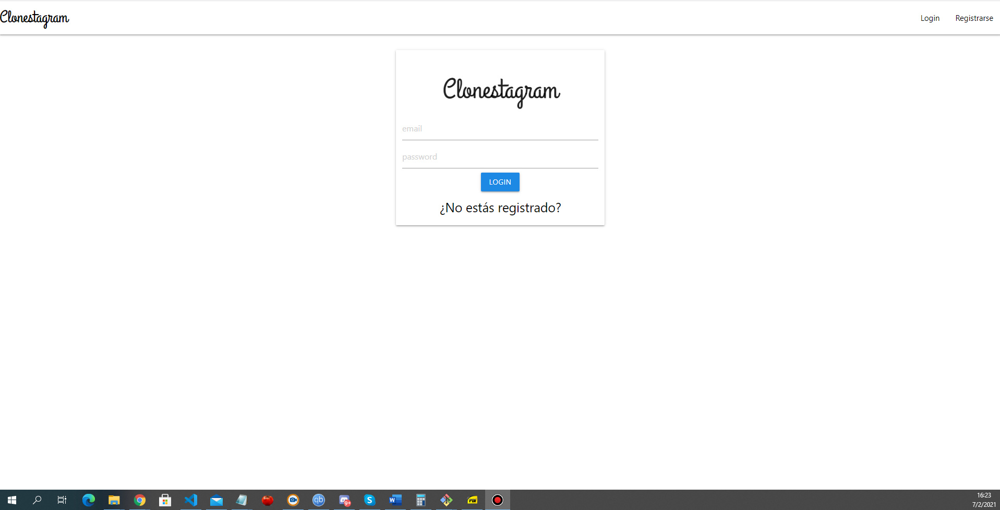
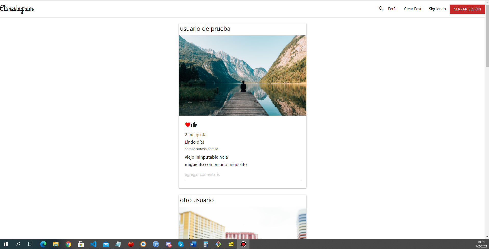
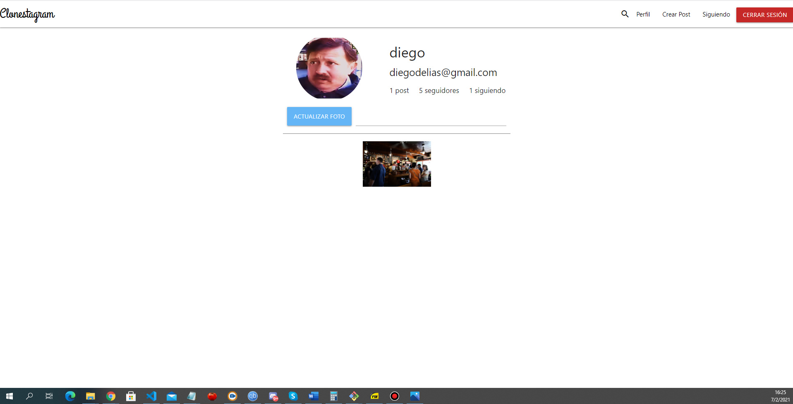
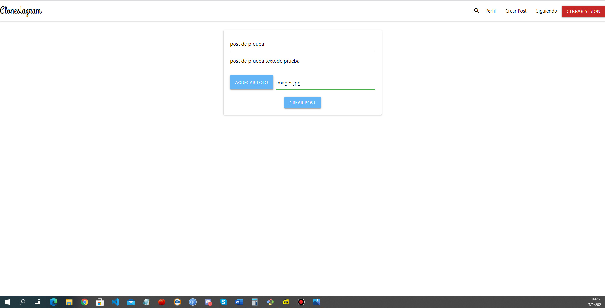
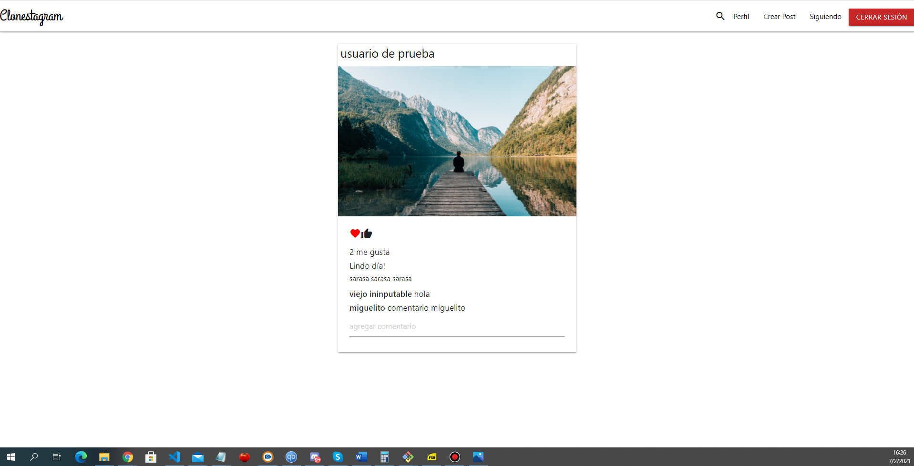
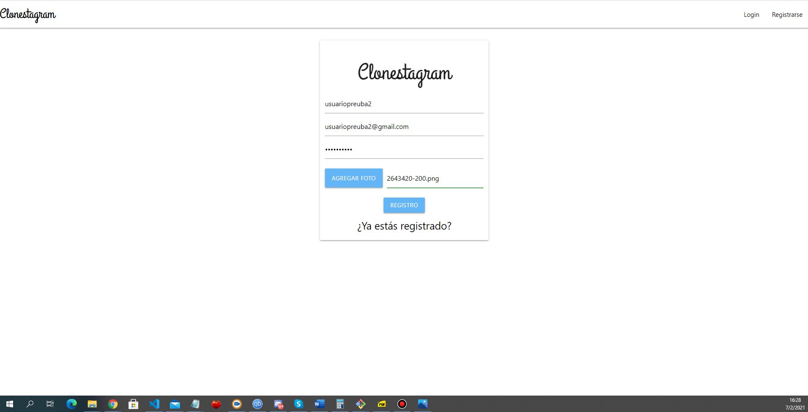

Para descargar y probar el proyecto:

-clonar el repositorio https://github.com/Diegodelias/Clon-Instagram-backend-nodejs-mongo-db

-instalar dependencias server. Desde terminal en carpeta server npm i

-instalar dependencias cliente. Desde terminal en carpeta cliente npm i.

-Arrancar server. En carpeta server desde terminal nodemon ejecutar nodemon dev

-Arrancar cliente. En carpeta cliente desde terminal npm start

video explicativo del proyecto:https://vimeo.com/483077863
Link al proyecto alojado en Heroku: https://clonestagram-diegodelias.herokuapp.com

Se trata de una aplicación  web en que los usuarios pueden crear una cuenta, loguearse y crear posts
con texto y fotos. El sitio soporta la creación de varios perfiles de usuario. El proyecto corresponde al 
trabajo final de la materia Seminario 2 cursada en el intstituto de formación técnica superior(IFTS 16)
correspondiente a la carrera de Técnico superior en analisis de sistemas.

Historias de usuario:

-El usuario puede crear una cuenta y agregar su foto de perfil
- El usuario puede crear post con fotos y texto
- El usuario puede acceder a su perfil y ver un listado con todos sus posts y actualizar foto de
perfil
- El usuario puede acceder al perfil de otro usuario y ver todas todos los posts de este.
-El usuario puede crear comentarios en los posts
- El usuario puede dar like a un post
- El usuario puede ver perfil de otros usuarios.
-El usuario puede seguir a otro usuario
- En el perfil del usuario aparece un contador indicando cantidad de seguidores.
- El usuario puede buscar el perfil de otro usuario ingresando mail del usuario en la barra de
búsqueda del sitio

